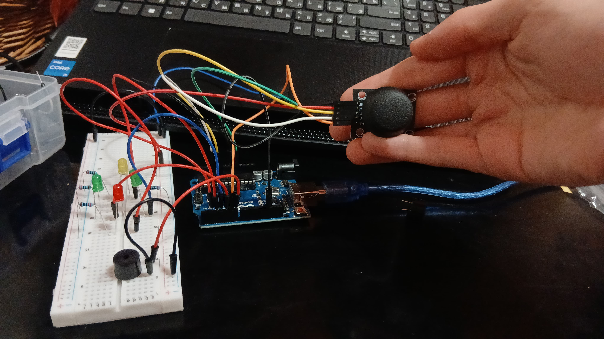

# Joystick Controller with Arduino 🎮



## 📌 Overview
This project is a **Joystick Controller** that allows you to control movements based on joystick inputs. The controller utilizes an analog joystick module and operates with an Arduino. The X and Y axis values are read to determine directional movements, while a button press activates a buzzer for alerts.

## 🔍 How It Works
The analog joystick provides X and Y axis readings that are processed by the Arduino.

The buzzer sounds an alert when the joystick button is pressed.

The direction of movement is determined by the joystick's position:

- Move left when X-axis value is low.
- Move right when X-axis value is high.
- Move up when Y-axis value is low.
- Move down when Y-axis value is high.

The values of the joystick axes and button state are printed to the serial monitor for debugging.

## 🎯 Applications
- Remote control systems 🚀
- Game controllers 🎮
- Robotic movement 🤖

## 📌 Future Improvements
- Implement smooth movement controls for better precision.
- Add LED indicators for directional movements.
- Integrate with a motor driver for physical movement applications.

📢 Feel free to contribute or modify the project! 🛠️✨

## 🛠️ Components Used
- **Arduino Board**
- **Analog Joystick Module**
- **Passive Buzzer**
- **Jumper Wires**
- **Breadboard**

## 📜 Code
```cpp
#define Xaxis_pin A0
#define Yaxis_pin A1
#define Sw_pin 6
#define UP 3
#define RIGHT 4
#define DOWN 2
#define LEFT 5
#define X_ANALOG A0
#define Y_ANALOG A1
#define BUZZER_PIN 6

int x_value = 0;
int y_value = 0;
int z_value = 0;

void pinModesForJoystick() {
  pinMode(Xaxis_pin, INPUT);
  pinMode(Yaxis_pin, INPUT);
  pinMode(Sw_pin, INPUT_PULLUP);
  pinMode(X_ANALOG, INPUT);
  pinMode(Y_ANALOG, INPUT);
}

void pinModesForMoves() {
  pinMode(LEFT, OUTPUT);
  pinMode(RIGHT, OUTPUT);
  pinMode(UP, OUTPUT);
  pinMode(DOWN, OUTPUT);
  pinMode(BUZZER_PIN, OUTPUT);
}

void movesStartOff() {
  digitalWrite(LEFT, LOW);
  digitalWrite(RIGHT, LOW);
  digitalWrite(UP, LOW);
  digitalWrite(DOWN, LOW);
}

void xyzValues() {
  x_value = analogRead(X_ANALOG);
  y_value = analogRead(Y_ANALOG);
  z_value = digitalRead(Sw_pin);
}

void xValues() {
  Serial.print("X-axis: ");
  Serial.print(x_value);
  Serial.print(" : ");
}

void yValues() {
  Serial.print("Y-axis: ");
  Serial.print(y_value);
  Serial.print(" : ");
}

void zValues() {
  Serial.print("Button (z_value): ");
  Serial.println(z_value);
}

void setup() {
  pinModesForJoystick();
  Serial.begin(9600);
  pinModesForMoves();
}

void loop() {
  movesStartOff();
  xyzValues();
  xValues();
  yValues();
  zValues();
  delay(100);

  if (x_value < 50) {
    digitalWrite(LEFT, HIGH);
  }
  else if (x_value > 973) {
    digitalWrite(RIGHT, HIGH);
  }

  if (y_value < 50) {
    digitalWrite(UP, HIGH);
  }
  else if (y_value > 973) {
    digitalWrite(DOWN, HIGH);
  }

  if (z_value == LOW) {
    digitalWrite(BUZZER_PIN, HIGH);
  } else {
    digitalWrite(BUZZER_PIN, LOW);
  }
}
